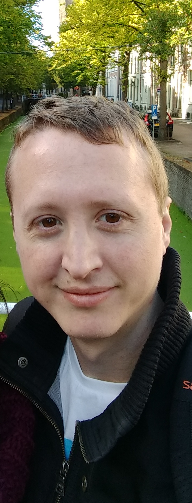

#### Dr. Leonardo Scandolo

I'm a software developer and researcher interested in all technologies related to computer graphics, visual media, high performance computing, and beyond.

Currently, I'm working as a post-doctoral researcher at TU Delft, involved in a variety of topics within the Computer Graphics and Visualization group.

In this page you will find a small recap of past projects, and possibly insights into new and exciting ones. 

